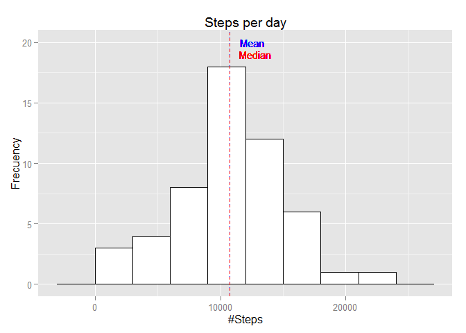
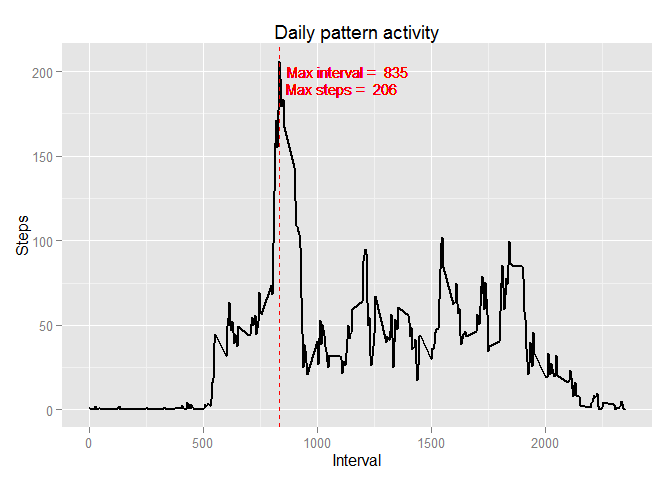
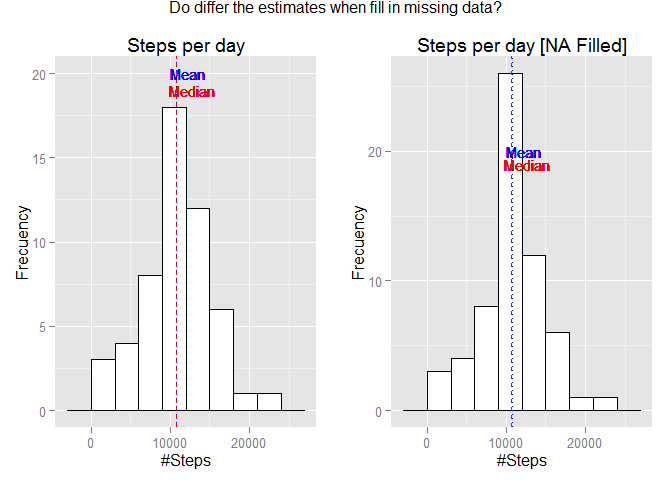
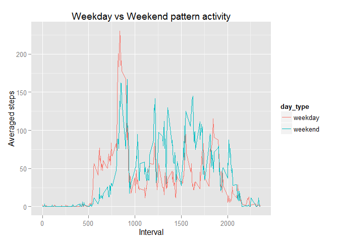

# Reproducible Research: Peer Assessment 1

## Loading and preprocessing the data

First we need to unzip and load the data ...


```r
data <- read.csv(unz("activity.zip", "activity.csv"))

str(data)
```

```
## 'data.frame':	17568 obs. of  3 variables:
##  $ steps   : int  NA NA NA NA NA NA NA NA NA NA ...
##  $ date    : Factor w/ 61 levels "2012-10-01","2012-10-02",..: 1 1 1 1 1 1 1 1 1 1 ...
##  $ interval: int  0 5 10 15 20 25 30 35 40 45 ...
```

In this analysis we'll use the dplyr, ggplot2 and gridExtra packages


```r
library(dplyr)
library(ggplot2)
library(gridExtra)
```

## What is mean total number of steps taken per day?

To discover what's the mean total number os steps let's do:

1. Group the data by date, summarizing the steps with the sum function


```r
s1 <- data %>% 
        filter(!is.na(steps)) %>% 
        group_by(date) %>% 
        summarise(day_steps = sum(steps))
print(s1)
```

```
## Source: local data frame [53 x 2]
## 
##          date day_steps
## 1  2012-10-02       126
## 2  2012-10-03     11352
## 3  2012-10-04     12116
## 4  2012-10-05     13294
## 5  2012-10-06     15420
## 6  2012-10-07     11015
## 7  2012-10-09     12811
## 8  2012-10-10      9900
## 9  2012-10-11     10304
## 10 2012-10-12     17382
## ..        ...       ...
```


```r
summary(s1)
```

```
##          date      day_steps    
##  2012-10-02: 1   Min.   :   41  
##  2012-10-03: 1   1st Qu.: 8841  
##  2012-10-04: 1   Median :10765  
##  2012-10-05: 1   Mean   :10766  
##  2012-10-06: 1   3rd Qu.:13294  
##  2012-10-07: 1   Max.   :21194  
##  (Other)   :47
```

2. Print a histogram plot


```r
plot1 <- ggplot(s1, aes(x=day_steps)) + 
        geom_histogram(binwidth=3000, colour="black", fill="white") +
        geom_vline(xintercept=mean(s1$day_steps), color ="blue", linetype="dotted") +
        geom_vline(xintercept=median(s1$day_steps), color ="red", linetype="dashed") +
        labs(title="Steps per day", x="#Steps", y="Frecuency") +
        geom_text(aes(x=mean(s1$day_steps) + 2000, 
                      label="Mean  ", y=20), colour="blue", size=4 ) +
        geom_text(aes(x=median(s1$day_steps) + 2000, 
                      label="Median", y=19), colour="red", size=4)

plot1
```

 

## What is the average daily activity pattern?

To discover what's the average daily activity pattern let's do:

1. Group the data by interval, summarizing the steps with the mean function


```r
s2 <- data %>% 
        filter(!is.na(steps)) %>% 
        group_by(interval) %>% 
        summarise(day_steps = mean(steps))
print(s2)
```

```
## Source: local data frame [288 x 2]
## 
##    interval day_steps
## 1         0 1.7169811
## 2         5 0.3396226
## 3        10 0.1320755
## 4        15 0.1509434
## 5        20 0.0754717
## 6        25 2.0943396
## 7        30 0.5283019
## 8        35 0.8679245
## 9        40 0.0000000
## 10       45 1.4716981
## ..      ...       ...
```


```r
summary(s2)
```

```
##     interval        day_steps      
##  Min.   :   0.0   Min.   :  0.000  
##  1st Qu.: 588.8   1st Qu.:  2.486  
##  Median :1177.5   Median : 34.113  
##  Mean   :1177.5   Mean   : 37.383  
##  3rd Qu.:1766.2   3rd Qu.: 52.835  
##  Max.   :2355.0   Max.   :206.170
```

2. Find out which interval contains the maximum steps ...


```r
o <- s2 %>% 
        arrange(desc(day_steps)) 

max_interval <- as.numeric(o[1,1])
max_steps  <- as.integer(o[1,2])

print(max_interval)
```

```
## [1] 835
```

```r
print(max_steps)
```

```
## [1] 206
```


3. Draw the line plot with the average pattern


```r
label_interval <- paste("Max interval = ", max_interval)
label_steps <-paste("Max steps = ", max_steps, "  ")
ggplot(s2, aes(x=interval, y=day_steps)) + 
        geom_line(colour="black", size=1) +
        geom_vline(xintercept=max_interval, color ="red", linetype="dashed") +
        labs(title="Daily pattern activity", x="Interval", 
             y="Steps") +
        geom_text(aes(x=max_interval + 300, y=200, label= label_interval), colour="red", size=4) +
        geom_text(aes(x=max_interval + 300, y=190, label= label_steps), colour="red", size=4)
```

 

## Imputing missing values

To calculate the total number of missing values in the dataset let's use the table function


```r
table(is.na(data$steps))
```

```
## 
## FALSE  TRUE 
## 15264  2304
```

There are 2.304 NA values in the dataset

My strategy for filling in the NA values will be fill with the mean value of all steps in the same interval.  

First let's split the dataset into two diferents data frames, one with NA values and the other wihtout them.  


```r
fullData <- data[!is.na(data$steps),]
emptyData <- data[is.na(data$steps),]
```

Calculate the mean steps in each interval


```r
m <- fullData %>% 
        group_by(interval) %>% 
        summarise(mean_steps = as.integer(mean(steps)))
```

Fill in all the values of the empty data frame.


```r
for (row in 1:nrow(emptyData)){  
        row_interval <- emptyData[row, "interval"]
        mean_steps <- as.integer(
                m %>% 
                filter(interval == row_interval) %>%
                select(mean_steps)
        )
        
        emptyData[row, "steps"] <- mean_steps
}
```

The last operation will be bind the two data frames (empty and full) into one named allData


```r
allData <- rbind(fullData, emptyData)

summary(allData)
```

```
##      steps                date          interval     
##  Min.   :  0.00   2012-10-01:  288   Min.   :   0.0  
##  1st Qu.:  0.00   2012-10-02:  288   1st Qu.: 588.8  
##  Median :  0.00   2012-10-03:  288   Median :1177.5  
##  Mean   : 37.33   2012-10-04:  288   Mean   :1177.5  
##  3rd Qu.: 27.00   2012-10-05:  288   3rd Qu.:1766.2  
##  Max.   :806.00   2012-10-06:  288   Max.   :2355.0  
##                   (Other)   :15840
```

and draw an histogram plot with the two data frames at the same time


```r
s3 <- allData %>% 
        filter(!is.na(steps)) %>% 
        group_by(date) %>% 
        summarise(day_steps = sum(steps))

plot3 <- ggplot(s3, aes(x=day_steps)) + 
        geom_histogram(binwidth=3000, colour="black", fill="white") +
        geom_vline(xintercept=mean(s3$day_steps), color ="blue", linetype="dotted") +
        geom_vline(xintercept=median(s3$day_steps), color ="red", linetype="dashed") +
        labs(title="Steps per day [NA Filled]", x="#Steps", y="Frecuency") +
        geom_text(aes(x=mean(s3$day_steps) + 2000, 
                      label="Mean  ", y=20), colour="blue", size=4 ) +
        geom_text(aes(x=median(s3$day_steps) + 2000, 
                      label="Median", y=19), colour="red", size=4)

grid.arrange(plot1, plot3, ncol = 2, main = "Do differ the estimates when fill in missing data?")
```

 

We can see that the median and the mean are almost equal for the two datasets, so when we use NA values **don't differ** from the estimates from the first part of the assignment


```r
summary(s1$day_steps)
```

```
##    Min. 1st Qu.  Median    Mean 3rd Qu.    Max. 
##      41    8841   10760   10770   13290   21190
```


```r
summary(s3$day_steps)
```

```
##    Min. 1st Qu.  Median    Mean 3rd Qu.    Max. 
##      41    9819   10640   10750   12810   21190
```

## Are there differences in activity patterns between weekdays and weekends?

First let's create a new factor column to divide between weekdays and weekends


```r
allData$date <- as.Date(allData$date)
allData$day_type <- as.factor(c("weekend", "weekday", "weekday", "weekday", "weekday", "weekday", "weekend")[as.POSIXlt(allData$date)$wday + 1])

table(allData$day_type)
```

```
## 
## weekday weekend 
##   12960    4608
```


Later let's group the data by interval and day type, summarizing the steps with the mean function


```r
s4 <- allData %>% 
        group_by(interval, day_type) %>% 
        summarise(day_steps = mean(steps))

print(s4)
```

```
## Source: local data frame [576 x 3]
## Groups: interval
## 
##    interval day_type  day_steps
## 1         0  weekday 2.15555556
## 2         0  weekend 0.12500000
## 3         5  weekday 0.40000000
## 4         5  weekend 0.00000000
## 5        10  weekday 0.15555556
## 6        10  weekend 0.00000000
## 7        15  weekday 0.17777778
## 8        15  weekend 0.00000000
## 9        20  weekday 0.08888889
## 10       20  weekend 0.00000000
## ..      ...      ...        ...
```


```r
summary(s4)
```

```
##     interval         day_type     day_steps      
##  Min.   :   0.0   weekday:288   Min.   :  0.000  
##  1st Qu.: 588.8   weekend:288   1st Qu.:  1.972  
##  Median :1177.5                 Median : 28.062  
##  Mean   :1177.5                 Mean   : 38.932  
##  3rd Qu.:1766.2                 3rd Qu.: 61.203  
##  Max.   :2355.0                 Max.   :230.356
```

Finally let draw a line plot coloring the data by day type so we can see the differences in activity patterns between weekdays and weekends.


```r
qplot(interval, day_steps, data = s4, color =day_type, geom = "line",
     xlab = "Interval", ylab = "Averaged steps") +  
        labs(title = "Weekday vs Weekend pattern activity")	
```

 

It looks like this person has a walking weekday pattern different from weekends.
